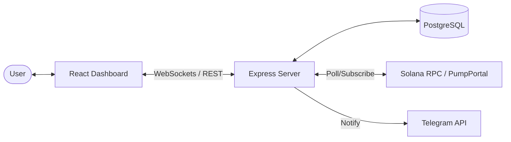

# 🚀 Wallet Tracker | Solana Transaction Monitor

[](LICENSE)
[](https://nodejs.org/)
[](https://react.dev/)
[](https://www.prisma.io/)
[](https://solana.com/)
[](https://www.docker.com/)

**Wallet Tracker** is a state-of-the-art, real-time Solana wallet transaction tracking application. Designed for speed and precision, it monitors [pump.fun](https://pump.fun) trading activity, allowing users to follow successful wallets and receive instant notifications via WebSockets and Telegram.

---

## ✨ Engineering Highlights

This production-ready application showcases advanced software architecture and modern development practices:

### 🏗️ Backend Excellence

- **Repository Pattern**: Clean decoupling of business logic from data access, ensuring highly testable and maintainable code.
- **Real-time Pipeline**: High-performance transaction streaming using **Socket.io** and optimized event loops.
- **Robust Security**: Multi-layered security with **Passport.js (JWT)**, **Helmet**, and strictly validated request schemas via **Zod**.
- **Observability**: Centralized logging with **Winston** for deep insight into application health.
- **Interactive Documentation**: Full **OpenAPI/Swagger** suite with live testing capabilities.

### 🎨 Frontend Mastery

- **Feature-Sliced Design (FSD)**: A modular architectural pattern that scales linearly with project complexity.
- **Responsive UI**: Built with **React 19**, **Tailwind CSS**, and **DaisyUI** for a sleek, dark-themed dashboard.
- **State Management**: Zero-boilerplate data fetching and caching with **TanStack Query (v5)**.
- **Smooth UX**: Fluid interactions powered by **Framer Motion**.

---

## 🚀 Key Features

- 🔍 **Limitless Tracking**: Monitor any Solana wallet address with zero overhead.
- ⚡ **Real-time Stream**: Experience sub-second transaction updates via WebSocket.
- 🤖 **Telegram Integration**: Connect your account to a dedicated bot for on-the-go alerts.
- 📊 **Rich Context**: Detailed transaction data including Token Symbol, Type (Buy/Sell), USD Value, and Market Cap.
- 🏷️ **Smart Organization**: Assign custom aliases to wallets for easier tracking.

---

## 🛠️ Tech Stack

| Domain             | Technology                                                        |
| :----------------- | :---------------------------------------------------------------- |
| **Frontend**       | React 19, TypeScript, Vite, Tailwind CSS, DaisyUI, TanStack Query |
| **Backend**        | Node.js, Express, Socket.io, Passport.js, Zod, Winston            |
| **Database**       | PostgreSQL, Prisma ORM                                            |
| **Blockchain**     | @solana/web3.js, Metaplex                                         |
| **Messaging**      | Grammy (Telegram Bot Framework)                                   |
| **Infrastructure** | Docker, Docker Compose, Traefik (Edge Router)                     |

---

## 📐 System Architecture



---

## 🏁 Getting Started

### Prerequisites

- [Node.js](https://nodejs.org/) (v20 or higher)
- [pnpm](https://pnpm.io/) (Recommended)
- [Docker](https://www.docker.com/) & [Docker Compose](https://docs.docker.com/compose/)

### 🐳 Quick Start (Docker)

The fastest way to get up and running is using our optimized Docker setup:

```bash
# Clone the repository
git clone https://github.com/yourusername/wallet-tracker.git
cd wallet-tracker

# Start the development cluster
docker compose -f docker-compose.development.yaml up --build
```

- **Frontend**: [http://app.localhost](http://app.localhost)
- **API Docs**: [http://api.localhost/api-docs](http://api.localhost/api-docs)

### 💻 Manual Setup

1. **Install Dependencies**:

   ```bash
   pnpm install
   ```

2. **Configure Environment**:
   Copy the example environment files and fill in your secrets.

   ```bash
   cp backend/.env.example backend/.env.development
   ```

3. **Database Migration**:

   ```bash
   cd backend && pnpm prisma:migrate:dev
   ```

4. **Launch Application**:

   ```bash
   # Run Backend
   cd backend && pnpm dev

   # Run Frontend (New Terminal)
   cd frontend && pnpm dev
   ```

---

## ⚙️ Configuration

| Variable             | Description                  | Default |
| :------------------- | :--------------------------- | :------ |
| `PORT`               | API Port                     | `3001`  |
| `DATABASE_URL`       | PostgreSQL Connection String | -       |
| `JWT_SECRET`         | Secret for Access Tokens     | -       |
| `TELEGRAM_BOT_TOKEN` | Token from @BotFather        | -       |

---

## 🧪 Testing

The project maintains high standards through comprehensive testing suites.

```bash
cd backend
pnpm test          # Run all tests
pnpm test:watch    # TDD mode
```

---

## 📄 License

This project is licensed under the **GNU Affero General Public License v3.0 (AGPL-3.0)**.

The AGPL is a strong copyleft license specifically designed for network server software. It ensures that if you run a modified version of this software as a service, your users have the right to receive the source code of that modified version.

See the [LICENSE](LICENSE) file for the full license text.

Developed with ❤️ for the Solana Community.
